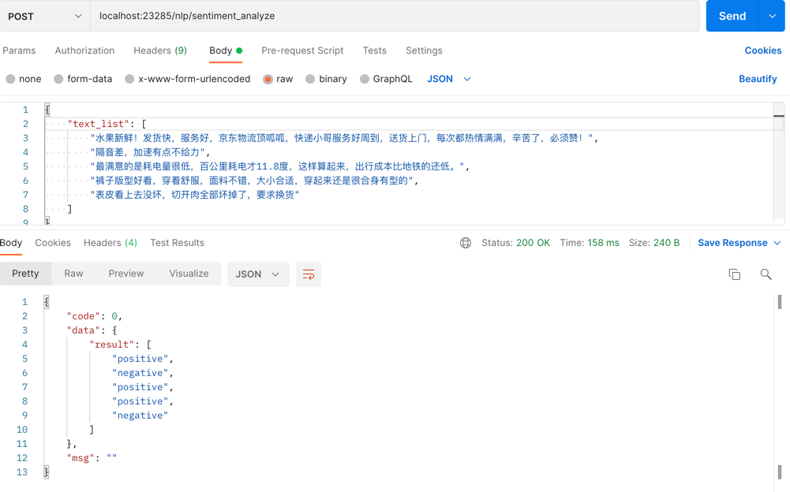

# Flask app for text classification (sentiment analysis) 

基于flask框架的albert中文情感分析服务

## requirement
```
absl_py==0.13.0
tensorflow==2.3.0
sentencepiece==0.1.96
six==1.16.0
Flask==1.1.2
numpy==1.18.5
grpcio==1.33.2
gunicorn==20.0.4
requests==2.25.0
gevent
```

## label
```
0: negative
1: positive
```

## saved_model
```
基于tf2.3 + python3.8 finetune保存的albert分类 .pb 模型
```
[albert_text_classification](https://github.com/xsqiii/albert-text-classification)

## start
```
本地启动
python api.py
```

## request
```
curl -H "Content-type: application/json" -X POST http://localhost:5000/nlp/sentiment_analyze -d '{"text_list":["水果新鲜！发货快，服务好，京东物流顶呱呱，快递小哥服务好周到，送货上门，每次都热情满满，辛苦了，必 赞！","隔音差，加速有点不给力"]}'
```

## docker
```
打镜像
docker build ./ -t [tag]     
# -t 打tag 
# 如 docker build ./ -t sentimentserving:latest

创建容器
docker run -d -p [port]:23280 --name [container name] [images name]
# 如 docker run -d -p 23285:23280 --name sentiment_serving sentimentserving:latest
```

## docker start
```
容器启动成功后, 可通过ip:port/route调用

curl命令: curl -H "Content-type: application/json" -X POST http://localhost:23285/nlp/sentiment_analyzer -d '{"texts":["水果新鲜！发货快，服务好，京东物流顶呱呱，快递小哥服务好周到，送货上门，每次都热情满满，辛苦了，必须赞！","隔音差，加  速有点不给力","最满意的是耗电量很低，百公里耗电才11.8度，这样算起来，出行成本比地铁的还低。"]}'
result: {"code": 0, "msg": "success", "data": {"result": ["positive", "negative", "positive"]}}
```

## postman

